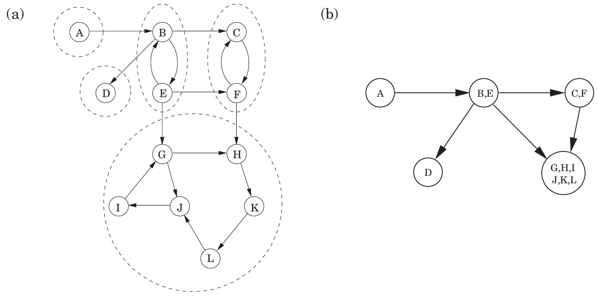
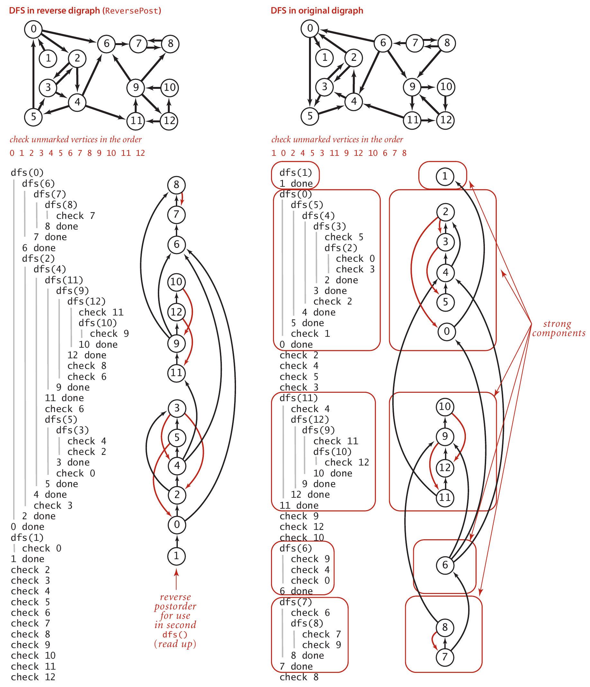

## Course

Algorithms: Design and Analysis, Part 1 
Stanford University, **Coursera**

## Problem

Your task is to code up the algorithm for computing strongly connected components (SCCs), and to run this algorithm on the given graph. 
**Output Format:** You should output the sizes of the 5 largest SCCs in the given graph, in decreasing order of sizes, separated by commas (avoid any spaces). If your algorithm finds less than 5 SCCs, then write 0 for the remaining terms. 
**Warning:** This is the most challenging programming assignment of the course. Because of the size of the graph, you may have to manage memory carefully. 

## Data

The file contains the edges of a directed graph. Vertices are labeled as positive integers from 1 to 875714. Every row indicates an edge, the vertex label in first column is the tail and the vertex label in second column is the head (recall the graph is directed, and the edges are directed from the first column vertex to the second column vertex).

## Kosaraju's algorithm

Strong connectivity is a useful abstraction in understanding the structure of a directed graph, highlighting interrelated sets of vertices (strong components). The decomposition of a directed graph into its strongly connected components is very informative and useful. It turns out, fortunately, that it can be found in linear time by making the further use of the depth-first search. The resulting algorithm is this.

1. Run depth-first search on **G**R.
2. Run the undirected connected components algorithm on **G**, and during the depth-first search, process the vertices in decreasing order of their post numbers from step 1.

## Figures

#### Figure 1.
(a) A directed graph and its strongly connected components. (b) The meta-graph.
> Dasgupta, Sanjoy, Christos H. Papadimitriou, and Umesh Vazirani. **Algorithms**. McGraw-Hill, Inc., 2006.

#### Figure 2.
Kosaraju’s algorithm for finding strong components in digraphs.
> Sedgewick, Robert, and Kevin D. Wayne. **Algorithms**. Addison-Wesley Professional, 2011.

